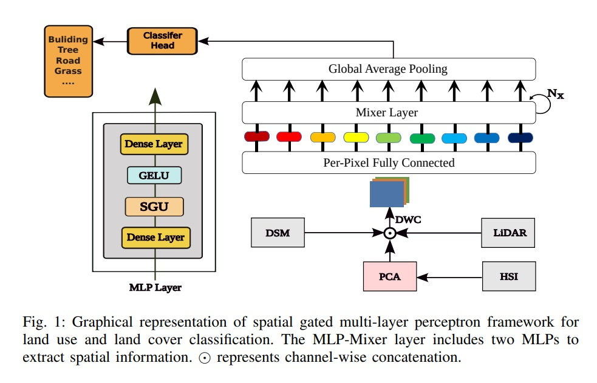
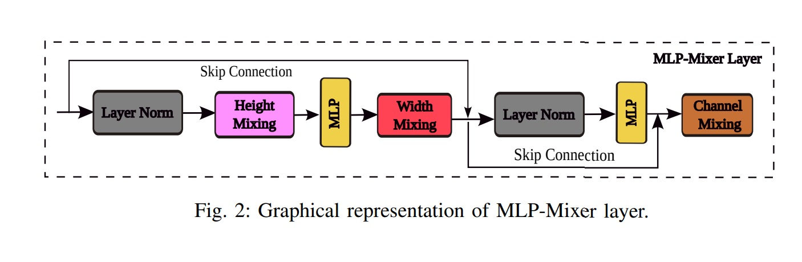

# Spatial Gated Multi-Layer Perceptron for Land Use and Land Cover Mapping

[Ali Jamali](https://www.researchgate.net/profile/Ali-Jamali), [Swalpa Kumar Roy](https://swalpa.github.io), [Danfeng Hong](https://sites.google.com/view/danfeng-hong), [Peter M Atkinson](https://www.lancaster.ac.uk/lira/people/peter-atkinson), and [Pedram Ghamisi](https://www.iarai.ac.at/people/pedramghamisi/)

___________

This Keras code is for the paper A. Jamali, Ali and Roy, Swalpa Kumar and Hong, Danfeng and Atkinson, Peter M and Ghamisi, Pedram, "[Spatial Gated Multi-Layer Perceptron for Land Use and Land Cover Mapping]," in IEEE Geoscience and Remote Sensing Letters, doi: 10.1109/LGRS.2024.3354175 [https://ieeexplore.ieee.org/document/10399888/].

Citation
---------------------

**Please kindly cite the papers if this code is useful and helpful for your research.**

        @article{10399888,
                title={Spatial Gated Multi-Layer Perceptron for Land Use and Land Cover Mapping},
                author={Jamali, Ali and Roy, Swalpa Kumar and Hong, Danfeng and Atkinson, Peter M and Ghamisi, Pedram},
                journal={IEEE Geoscience and Remote Sensing Letters}, 
                year={2024},
                volume={},
                number={},
                pages={1-5},
                doi={10.1109/LGRS.2024.3354175}
                }

  
Acknowledgement
---------------------

The Mixer block is implementated from [MLP-Mixer](https://github.com/google-research/vision_transformer). 

## License

Copyright (c) 2023 Ali Jamali. Released under the MIT License. See [LICENSE](LICENSE) for details.
